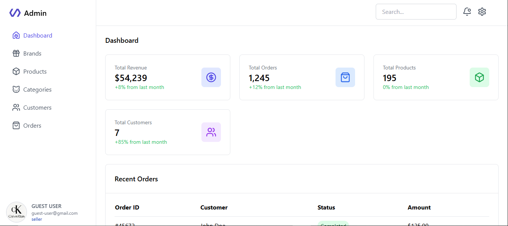
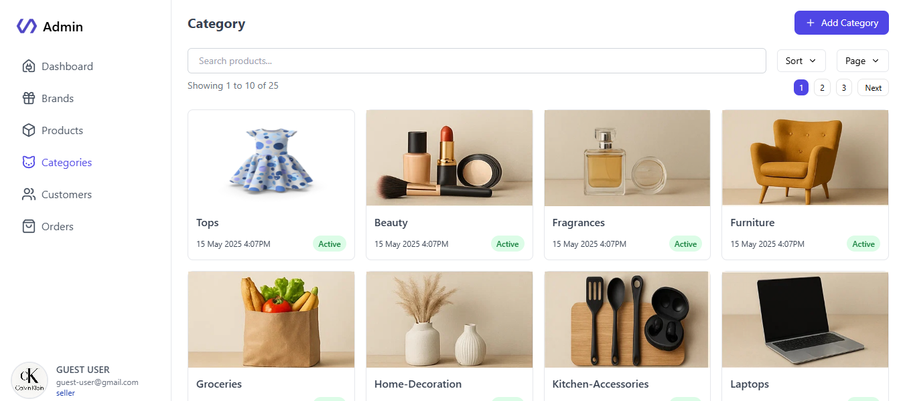
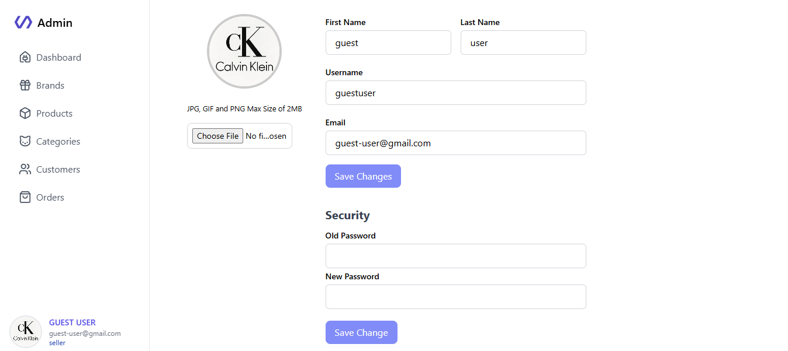
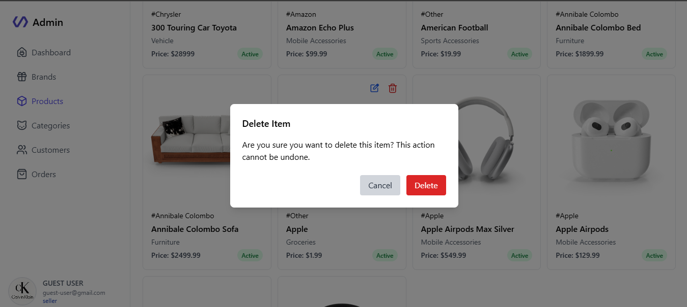
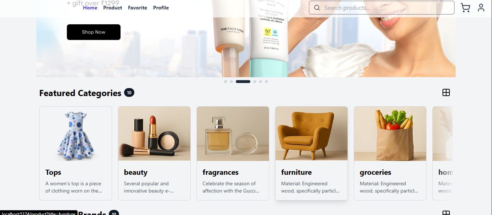
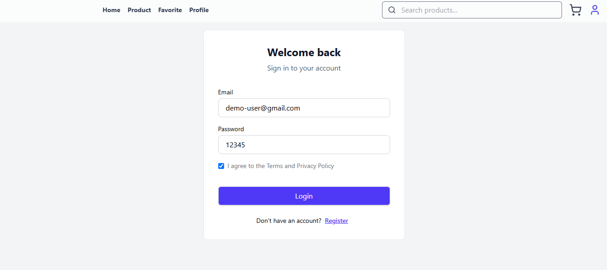

# E-commerce Store with AI Integration

Welcome to the E-commerce Store project! This application is built using the MERN stack (MongoDB, Express.js, React, Node.js) and integrates AI features to enhance user experience and operational efficiency.

## Features

### 1. User Authentication

- Sign up and login functionality (email/password, social media login).
- Password recovery and reset options.

### 2. Product Management

- Product listing with images, descriptions, and prices.
- Categories and filters for searching products by price, popularity, etc.
- Product detail pages with reviews and ratings.

### 3. Shopping Cart

- Add to cart functionality for products.
- View cart with item quantity adjustment and total price calculation.
- Save items for later.

### 4. Checkout Process

- Multiple payment options (credit card, PayPal, etc.).
- Address input and order summary before finalizing the purchase.
- Order confirmation and receipt generation.

### 5. User Profile

- User account management (view order history, update personal information).
- Wishlist feature for saving favorite items.

### 6. Admin Panel

- Dashboard for managing products, orders, and users.
- Analytics for sales, user activity, and inventory status.
- Ability to add, edit, or delete products.

### 7. AI Features

- **Product Recommendations:** Personalized product suggestions based on user behavior and preferences.
- **Chatbot Support:** AI-driven customer support chat for answering common queries and guiding users.
- **Smart Search:** Enhanced search functionality using natural language processing (NLP) to improve search results.
- **Dynamic Pricing:** AI algorithms to adjust product prices based on demand, competition, and user engagement.

### 8. Review and Rating System

- Users can leave reviews and ratings for products.
- AI moderation to filter inappropriate content.

### 9. Notifications and Alerts

- Email/SMS notifications for order updates, promotions, and abandoned cart reminders.
- Alerts for low-stock items or price drops.

### 10. Responsive Design

- Mobile-friendly layout for easy navigation on smartphones and tablets.
- Fast loading times and optimized user experience.

### Admin Panel

### E-Cartify Store

## Getting Started

### Installation

1. Clone the repository: `https://github.com/AdarshTheki/full-stack-ecommerce-app.git`
2. Set up the folder: `cd ../client`, `cd ../server` & `cd ../admin`
3. Install dependencies of each folder structure: `npm install`
4. Start the development server: `npm run dev`
5. Open the website in your browser: `http://localhost:3000`

### License

This project is licensed under the [MIT License]().

### Author

**[Adarsh Verma]()**
